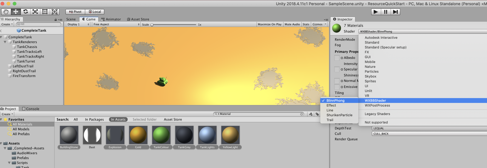
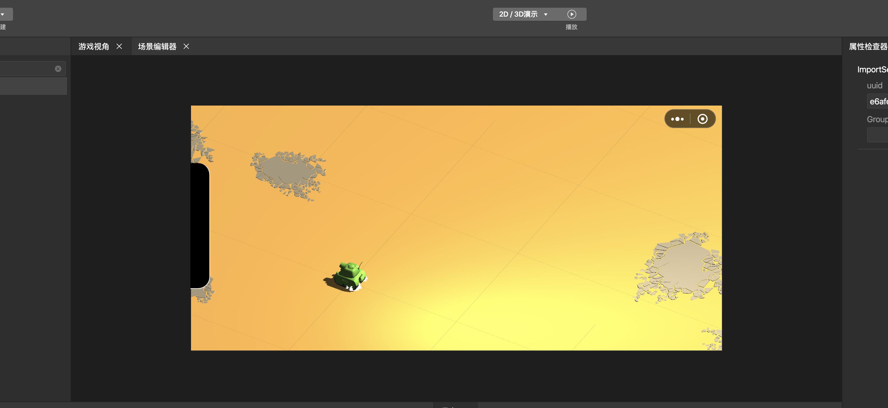

## 快速入门
本文档演示一个极简Unity工程如何利用导出插件导出资源然后使用微信方案工具二次开发。

温馨提示：
* 本示例采用Unity2018.4.11.c1；
* 文档最后更新时间：2020.6.16；

### Unity 原始工程
本示例的逻辑非常简单，场景内有 Ground 和 Tank 两个Prefab，整个游戏有两个脚本，第一个为 Fllow，保证相机跟随坦克，第二个脚本为 TankMovement，用于监听事件并控制坦克移动。


```
// Follow
using UnityEngine;
using System.Collections;

  public class Fllow : MonoBehaviour
  {
    public Transform player; // 主角位置
    public float speed = 5f; // 相机速度   
    Vector3 distance; // 主角和摄像机之间的距离                   


    void Start()
    {
     
      distance = transform.position - player.position;
    }

    void Update()
    {
      Vector3 targetCamPos = player.position + distance;

      transform.position = targetCamPos;
    }
  }

```

```
// TankMovement
using UnityEngine;

public class TankMovement : MonoBehaviour {
  private ParticleSystem[] m_particleSystems; // References to all the particles systems used by the Tanks

  private bool flag = false;
  private UnityEngine.Vector3 origin;
  public const float sensitivity = 0.01f;

  private void OnEnable () {
    m_particleSystems = GetComponentsInChildren<ParticleSystem> ();
    for (int i = 0; i < m_particleSystems.Length; ++i) {
      m_particleSystems[i].Play ();
    }
  }

  private void Update () {
    if (UnityEngine.Input.GetMouseButtonDown (0)) {
      if (!flag) {
        flag = true;
        origin = UnityEngine.Input.mousePosition;
      }

    }
    if (flag) {
      var dir = new UnityEngine.Vector3 ((origin.x - UnityEngine.Input.mousePosition.x) * sensitivity,
        0.0f, (origin.y - UnityEngine.Input.mousePosition.y) * sensitivity);

      if (dir.magnitude < 0.00000001f) {
        if (UnityEngine.Input.GetMouseButtonUp (0)) {
          flag = false;
        }
        return;
      }

      if (dir.magnitude > 0.1f) {
        dir = dir.normalized * 0.1f;
      }
      var backup = this.gameObject.transform.position;

      this.gameObject.transform.position = this.gameObject.transform.position - dir;
      this.gameObject.transform.forward = -dir.normalized;
    }
    if (UnityEngine.Input.GetMouseButtonUp (0)) {
      flag = false;
    }
  }
}
```
可以直接 Unity 添加工程 examples/QuickStart 并运行游戏来查看效果。

### 2.下载导入插件

[点击下载](https://dldir1.qq.com/WechatWebDev/plugins/BeefBallEngine-unitytool/1.0.0/UnityTool.unitypackage)插件，下载完成之后双击即可安装插件。


当插件安装完成之后，会多出一个**微信小游戏**的菜单，我们点击`微信小游戏->拓展模块管理->核心模块->安装`来安装模块。


### 3.执行导出
插件安装完成后，在 All Materials 菜单将材质设置为 WXBBShader/BlinnPhong，其中 Dust 需要特殊设置为 WXBBShader/ShurikenParticle
 

Shader设置完成之后就可以执行资源导出操作了。
 
首先我们需要创建一个空的小游戏工程，点击"创建小游戏项目模板"即可开始执行导出操作，先执行**当前场景**导出

导出完成后会生成下列文件：


### 4.导入开发工具
接下来我们在微信开发者工具进行调试预览工作，首先[下载](https://developers.weixin.qq.com/miniprogram/dev/devtools/nightly.html)最新的微信开发者工具，下载完成之后导入刚才新建的小游戏工程。

导入工程之后，点击方案工具，进入微信方案编辑器。


右键选中assets可以批量解包:


解包完成，双击打开解压出来的场景，可以发现IDE内已经可以展示场景了，但并不能移动，因为挂载的脚本都没有导出，这里需要重新开发。


### 5.游戏逻辑开发
接下来我们要进行游戏逻辑开发， 也就是将上面提到的 Fllow 和 TankMovement 用微信引擎的方式开发一遍。
