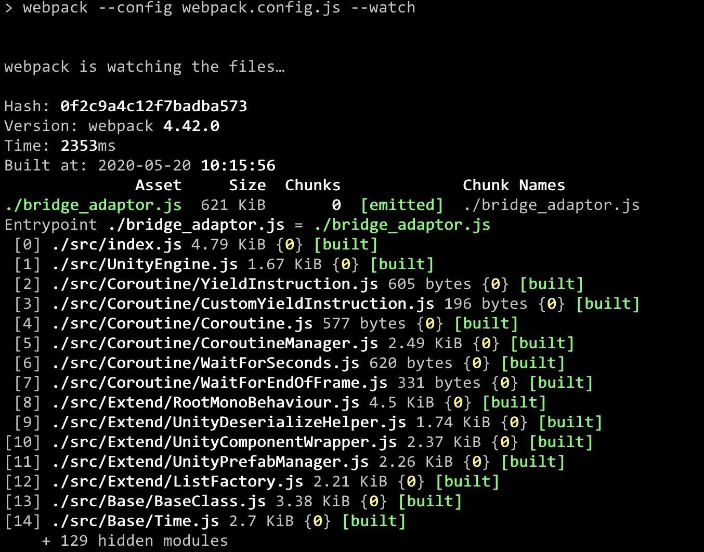
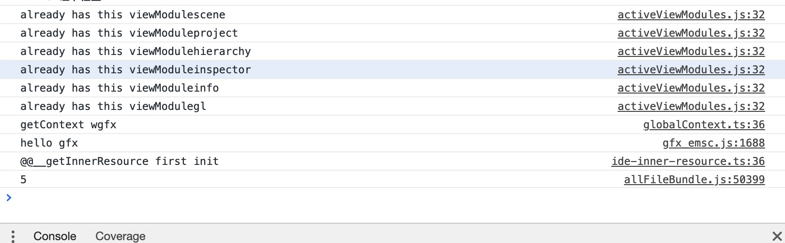

## 搭建开发环境

- 1.进入目录： `js-adaptor`
- 2.配置构建环境：
```
安装Node: https://nodejs.org/zh-cn/download/
安装依赖: npm install
```

## 更改构建路径

按照导出插件流程，adaptor会被构建到两个地方:

- 1.经过导出插件一键转换脚本之后，adaptor会被自动打包到`WXScripts.mgepackage/minigame-adaptor.js`
- 2.在微信微信引擎开发工具构建项目成功之后，adaptor会被自动打包到`minigame/assets/minigame-adaptor.js`

如果要手动适配adaptor接口，修改构建脚本webpack.config.json:
```js
var path    = require('path');
var webpack = require('webpack');

module.exports = {
    mode: 'none',
    entry:{
        // 这里填写成最终构建路径
       "path/to/minigame/assets/minigame-adaptor.js"    : './src/index',
    },
    output:{
        path: path.resolve(__dirname, ""),
        filename: "[name]", // string
    },
    module: {
        rules: [
            {
            test: /\.m?js$/,
            exclude: /(node_modules|bower_components)/,
            use: {
                loader: 'babel-loader',
                options: {
                presets: ['@babel/preset-env']
                }
            },
            parser: {
                system: false
            }

            }
        ]
    },
    plugins: [
    ]
};
```

## 执行构建
执行`npm run dev`就可以开始适配工作了。



## 适配思路
这里随机选了个Unity接口[BroadcastMessage](https://docs.unity3d.com/2018.3/Documentation/ScriptReference/GameObject.BroadcastMessage.html)作为适配用例。

### 步骤一: 阅读Unity文档，了解接口用途
查看Unity文档可以知道这个接口的用途如下
> Calls the method named methodName on every MonoBehaviour in this game object or any of its children.

以文档上面的示例代码作为测试用例：
```cs
using UnityEngine;

public class TestComponent1: MonoBehaviour
{
    void Start()
    {
        /// Calls the function ApplyDamage with a value of 5
        /// // Every script attached to the game object and all its children
        // that has a ApplyDamage function will be called.
        gameObject.BroadcastMessage("ApplyDamage", 5.0);
    }
}


public class TestComponent2: MonoBehaviour
{
    public void ApplyDamage(float damage)
    {
        print(damage);
    }
}
```

在Unity运行结果如下
```
5
UnityEngine.MonoBehaviour:print(Object)
```

### 步骤二：找到该方法的桩代码进行适配
找到Adaptor对应的方法`CoreModule/GameObject.js`，如果该方法没有适配，函数体如下
```js
throw new System.Exception("not impl");
```

该方法的思路很简单，遍历GameObject树的MonoBehaviour，如果具有名为BroadcastMessage第一个参数的方法，如上面测试用例提到的为`ApplyDamage`，执行之。

Adaptor 的作用就是通过填充 Unity 的接口，桥接到微信引擎的具体实现，那么适配之前要保证对微信引擎的每个方法足够了解，好的方式是去查看微信引擎的ts声明文件，了解每个类的属性和方法，微信引擎的ts声明文件位于`assets/node_modules/@types/engine/index.d.ts`。


定义模块变量hasBroadcastMessageReceiver，用于标记是否找到了具有对应方法的MonoBehaviour，通过调用微信引擎的getAllComponents接口遍历所有的Component
如果Component是MonoBehaviour的实例并且具有该方法，执行之。
```js
let hasBroadcastMessageReceiver = false;

_BroadcastMessage: function (entity, methodName, parameter) {
    entity.getAllComponents().forEach( item => {
        if ( item instanceof UnityEngine.MonoBehaviour && item[methodName] ) {
            hasBroadcastMessageReceiver = true;

            if ( parameter ) {
                item[methodName](parameter);
            } else {
                item[methodName]();
            }
        }
    });

    entity.transform.children.forEach( child => {
        this._BroadcastMessage(child.entity, methodName, parameter);
    });
},
BroadcastMessage: function (methodName) {
    hasBroadcastMessageReceiver = false;

    this._BroadcastMessage(this.ref, methodName);

    if ( !hasBroadcastMessageReceiver ) {
        console.error(`BroadcastMessage ${ methodName } has no receiver!`);
    }
},
```

### 步骤三：在小游戏工程验证正确性
按照quickstart流程，将测试用例导出后，在小游戏运行，可以发现控制台会输出和Unity一样的结果，就代表该方法适配完成了。

