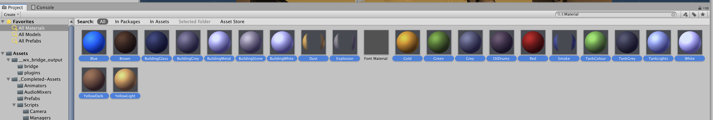
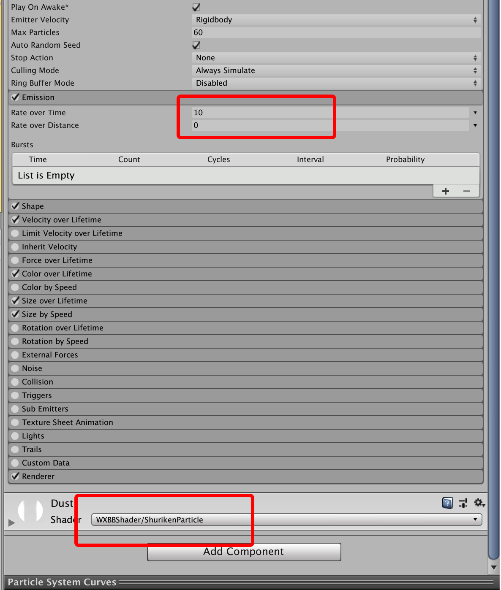
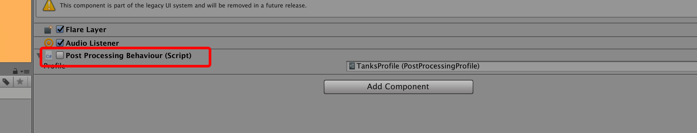
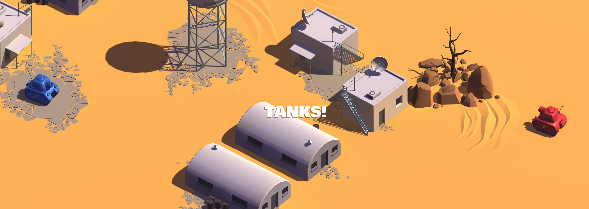

## 坦克大战示例

本示例演示将Unity AssetStore上的[Tanks! Tutorial](https://assetstore.unity.com/packages/essentials/tutorial-projects/tanks-tutorial-46209)教程用完整项目导出方案一步步改造迁移至微信小游戏。

温馨提示：
* 本示例采用Unity2018.4.11.c1；
* 文档最后更新时间：2020.6.11；

### 原始工程
游戏的玩法很简单，两个坦克在同一场景里面可以通过按键移动和射击，坦克有一定的血量，谁的血量为空则该轮为败方。按照最理想的情况，原始工程安装Unity导出插件之后一键导出成微信小游戏就完成了所有操作，但受限于导出方案当前的一些限制，需要对原始工程进行一定的改造，下面会一步步介绍需要哪些改动。

正常来讲只需要用Unity新建一个空项目然后从Asset Store引入[Tanks! Tutorial](https://assetstore.unity.com/packages/essentials/tutorial-projects/tanks-tutorial-46209)即可开始下面的改造，为了方便，可以直接从`examples/Tansks`开始。

### 原始工程改造

#### 1.资源处理
微信引擎对一些资源是有要求的，比如某些格式的文件资源不能使用，又比如单文件大小有要求，改动点如下：

1.原始工程内，背景音乐BackgroundMusic.wav达到了12M的大小，而微信引擎要求单文件最大上限为9M，这里找第三方工具进行压缩，压缩之后文件为4.85M。
2.原始工程内，使用了EngineIdle.aif文件，但是微信引擎不支持这种文件格式，删除;
3.因为原始工程是教程，一些在最终运行的游戏没有用到，这里删除tutorialInfo和Scripts文件夹；

#### 2.Shader
选中游戏内用到的所有Material，并将其Shader设置为WXBBShader/BlinnPhong，这是由于Shader的不一致，标准的Shader无法直接在微信侧对应使用。因此，导出插件提供了一个对应的BlinnPhong实现，效果和微信里的BlinnPhong是一致的。

具体操作为，在All Materials选中除了Font Material的资源，在inspector中选择shader为WXBBShader/BlinnPhong。


此时，如果执行删除并重新导入插件的操作，可能出现shader丢失的情况，需要重新按照上述操作设置shader。


#### 3.粒子系统
微信引擎的粒子系统不支持rate over distance属性，因此需要将坦克的Prefab `CompleteTank`里用到的rate over distance属性改成rate over Time属性，并且shader也要改成插件自带的WXBBShader/ShurikenParticle，如下如所示：


#### 4.插件清理
坦克教程里面用到了[Scriptable Render Pipeline](https://docs.unity3d.com/Manual/ScriptableRenderPipeline.html)技术，具体表现为使用了[postprocessing插件](https://docs.unity3d.com/Packages/com.unity.postprocessing@2.3/manual/Installation.html)，这种通过脚本来控制渲染管线在微信引擎里面是不支持的，删除插件，去掉引用即可。


#### 5.UI改造
游戏为了展示当前的堆栈信息，会有UI展示当前的对战状态，比如当前第几轮，双方的胜负结果如何。这部分UI是用UGUI实现的，目前为止整个导出方案都不兼容UGUI的方案，所以暂时将这部分UI删除，并且代码里面的引用相应删除。

而游戏或多或少都需要UI来增强游戏表现，目前的方案下，可以在整个导出流程完成之后，在小游戏工程上，按照微信引擎的工作流进行二次开发。


回到游戏中，需要做的有两件事情：

- 1.删除主场景的MessageCanvas节点；
- 2.注释脚本GameManager.cs对m_MessageText的使用；
- 3.删除CompleteTank对应的UI引用，也就是坦克下面的血条；

#### 6.物理引擎
微信引擎**暂时**不支持物理引擎，所以用到了物理引擎的Component都要移除，并且逻辑也要相应移除。相应的改动点如下：

1. 坦克本身和子弹的碰撞检测依赖了物理引擎，绑定了Component Rigidbody，需要移除；
2. 手动实现碰撞检测逻辑，思路也比较简单，实现一个给场景挂一个PhyWorld的GameObject和对应的脚本，在游戏开始的时候，采集所有的静态物体的BoxCollider信息，如岩石和房子等，并且在坦克初始化的时候采集两个坦克的BoxCollider信息。那么在坦克移动的时候就可以判断是否碰到了静态物体，可以防止穿透和实现坦克调头逻辑。PhyWorld具体逻辑不展开，详见`Assets/_Completed-Assets/Scripts/PhyWorld.cs`。
```
// TankMovement.cs
var other = m_PhyWorld.CheckCollideWithStatic(m_boxCollider);
if (other != null)
{
    this.gameObject.transform.position = backup;
    Debug.Log("player intersect: " + other.name.ToString());
}
```
3. 子弹使用了物理引擎能力，这里同样要移除Component Rigidbody，并且简化碰撞效果。
```
// ShellExplosion.cs
private void Update()
{
    var time = DateTime.Now;
    var dt = (time - lastT).TotalSeconds;
    var lifeTime = (time - m_spawnTime).TotalSeconds;
    if (lifeTime >= m_MaxLifeTime)
    {
    ShellPool.Destroy(gameObject);
    }
    else
    {
    transform.position = transform.position + this.transform.forward * (float)dt * 20;
    var other = m_PhyWorld.CheckCollideWithPlayer(m_boxCollider, m_PlayerNumber);
    if (other != null)
    {
        other.GetComponent<TankHealth>().TakeDamage(30);
        Debug.Log("bullet intersect: " + other.name.ToString());
    }
    }
    lastT = DateTime.Now;
}
```

#### 7.输入事件
原工程里面是双人对战游戏，红蓝坦克通过不同的按键控制移动和射击，在小游戏里面没有键盘，输入来自于屏幕触摸事件，因此对原始工程进行一定改造：红色坦克固定不动，蓝色坦克通过屏幕触摸来控制方向和移动，详细改造可以查看`TankMovement.cs`。
```
if (flag)
{
    var dir = new UnityEngine.Vector3((origin.x - UnityEngine.Input.mousePosition.x) * sensitivity,
    0.0f, (origin.y - UnityEngine.Input.mousePosition.y) * sensitivity);

    // m_Body.SetLinearVelocity(new Vec3(dir.x, dir.y, dir.z));
    if (dir.magnitude > 0.1f)
    {
        dir = dir.normalized * 0.1f;
    }
    var backup = this.gameObject.transform.position;

    this.gameObject.transform.position = this.gameObject.transform.position - dir;
    this.gameObject.transform.forward = -dir.normalized;

    var other = m_PhyWorld.CheckCollideWithStatic(m_boxCollider);
    if (other != null)
    {
        this.gameObject.transform.position = backup;
        Debug.Log("player intersect: " + other.name.ToString());
    }
}

if (UnityEngine.Input.GetMouseButtonUp(0))
{
    flag = false;
}
```

### 小游戏工程
将原始工程按照上述要求进行改造之后，即可进行导出操作（通常来讲改造都不是一蹴而就的，有可能需要边改造边尝试导出），导出流程可见：[quickstart](../quickstart.md)
