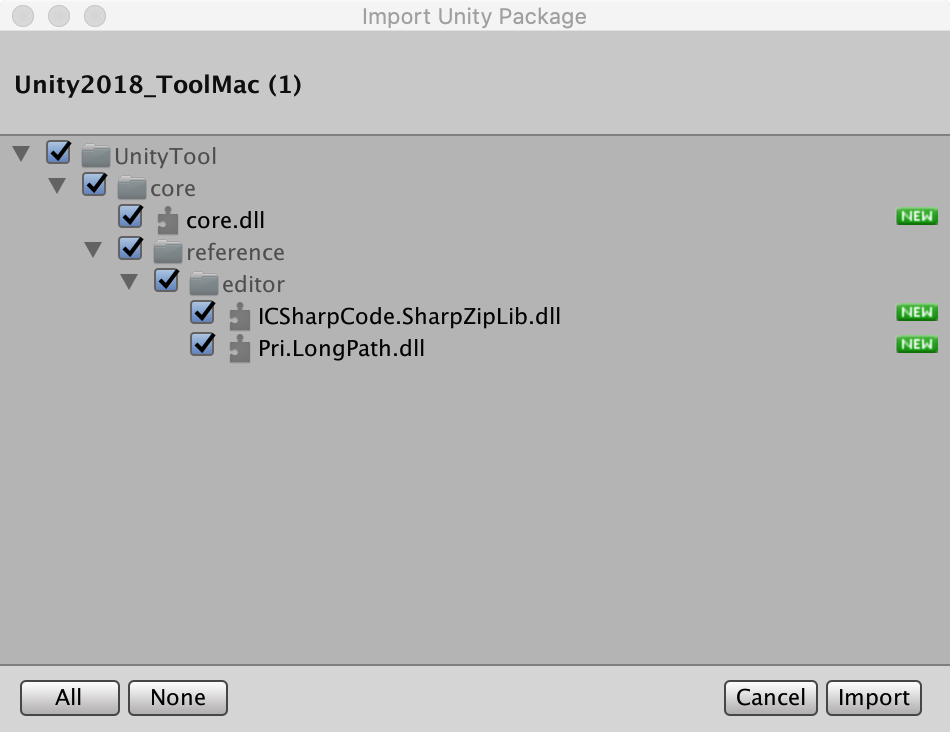
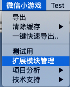
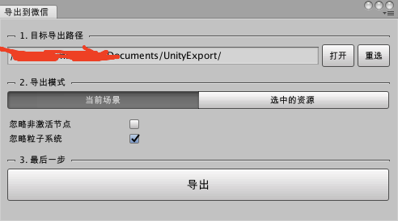

# 如何安装
下载转换工具的核心模块。
[点我下载](https://dldir1.qq.com/WechatWebDev/plugins/BeefBallEngine-unitytool/1.0.0/UnityTool.unitypackage)

下载下来会是一个unitypackage，所以你马上就能想到你可以双击导入它。

接下来你可以看到在你的unity菜单栏出现了新的导出能力，就说明你已经成功安装好了导出工具了

这时候选择扩展模块管理

以下这个新弹出的面板，是下载扩展导出模块的地方，在这里你可以选择下载你需要的导出能力，如后文会提到的**NGUI导出能力**或是**代码导出能力**。
但这个时候我们暂不需要在这做任何事情。

------------------------------------------------------------

回到菜单里选择**导出**，会弹出资源导出面板，后续的资源导出都会通过这个面板完成。

第一步你需要在这个面板里指定你的资源导出位置，你在这里可以选择快速创建一个引擎示例项目，将该项目作为你的导出路径。又或是你直接指定一个已存在的目录作为导出路径。

选择好路径之后，就可以开始进行导出了。可以看到导出面板里会出现几种导出模式供你选择。

------------------------------------------------------------

[下一节](./scene.md) 我们将会开始导出第一个场景