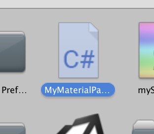

# 自己实现MaterialParser

## 一个将Standard parse为@system/blinnPhongNew的例子
比如说场景里有一些材质使用了Unity *Standard* Shader。  
我要将所有使用了*Standard*的材质在导出时替换成*WXBBShader/BlinnPhong*。

1. 在任意editor目录下下新建一个C# Script，起名MyMaterialParser(例)。  
   这个脚本主要是为了选择Effect，以及填充material参数。
   
     

2. 点开C#脚本编写代码：
    ```cs
    using System;
    using UnityEngine;  

    namespace WeChat
    {
        [InitializeOnLoad]
        class MyMaterialParser : WXMaterialParser
        {

            static MyMaterialParser()
            {
                WXMaterial.registerParser("Standard", new MyMaterialParser());
            }

            // 原样保留即可
            protected override void SetEffect(String effect)
            {
                m_mainJson.SetField("effect", effect);
            }

            // 主要进行代码编写的位置
            public override void onParse(WXMaterial wxbb_material)
            {
                Material material = m_material;

                // 将材质所使用的Effect指定成方案内置Effect
                // 如果你有自己写好的effect，则这里填入你写的effect的名字
                SetEffect("@system/blinnPhongNew");

                // 导出Tiling和Offset参数
                Vector2 textureScale = material.GetTextureScale("_MainTex");
                Vector2 textureOffset = material.GetTextureOffset("_MainTex");
                AddShaderParam("_MainTex_ST", new float[4] { textureScale.x, textureScale.y, textureOffset.x, textureOffset.y });

                // 导出Albedo贴图
                AddTexture("_MainTex", "_MainTex");

                // 导出Smoothness
                AddShaderParam("_Shininess", material.GetFloat("_Glossiness"));
            }
        }

    }
    ```

3. 清缓存后再次进行导出就会发现，材质的shader被替换成了*BlinnPhong*。
