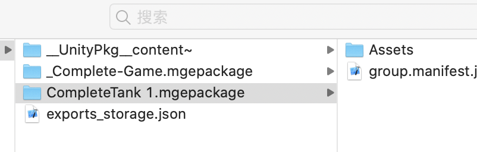

# 其它导出模式

除了导出当前场景之外，你其实可以在上节课的截图中看到还有一个**选中的prefab**的选项，这个就是导出插件提供的另一种`导出模式`。

下面我们尝试一下导出一个prefab，解释一下`导出模式`为何物。

------------------------------------------------------------

首先选中场景里的一个prefab，接下来你可以看到在导出面板中出现了**选中的prefab**选项。此时选择**导出**，在目标目录会生成一个与该prefab相关的mgepackage。

以上就是另一个`导出模式`的使用方法。与之前上一节课导出场景不同，这节课我们导出了一个prefab。

------------------------------------------------------------

除了**导出场景**和**导出prefab**两种`导出模式`，本导出插件还支持很多种其他的`导出模式`。

你可以回到第一节里提到的模块安装窗口里，安装其他导出模块。这将会提供给你更多的`导出模式`。

比如安装NGUI导出模块后，那么当你项目里包含NGUI的资源的时候，你就可以选择把它导出成微信方案的2D场景和2D prefab。

------------------------------------------------------------

接下来
如果你对美术资源的进阶导出知识有兴趣，参见[资源导出方案注意点](../basic/flow.md)。
如果你对代码导出有兴趣，参见[完整项目导出方案文档](../monobehavior/about.md)。
