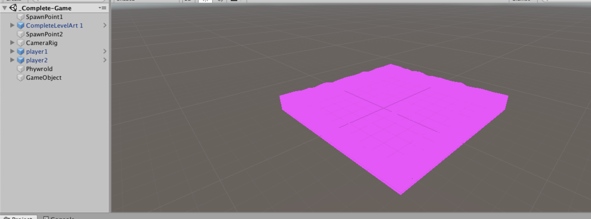
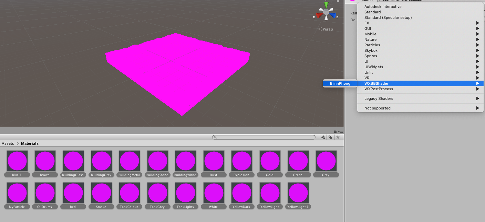
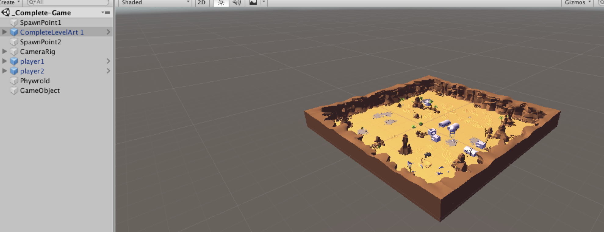
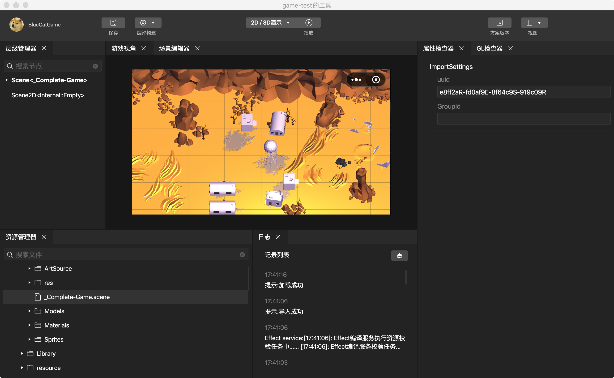

# 导出第一个场景

选中你unity项目里的一个场景，打开它

可以看到图中场景里是一片紫红色，这是因为笔者选用的这个场景里，所有material都没有选中合适的Shader。

当然如果你现在打开的是自己的游戏工程，可能会是稍微正常的表现

------------------------------------------------------------

但无论你的场景是否正常，都请你先框选这个场景用到的所有Material，并将其Shader设置为WXBBShader/BlinnPhong。
> 为什么要这么做？由于Unity和微信方案在Shader上的不一致，你的Shader导出后无法直接在微信侧对应使用，但本插件提供的WXBBShader/BlinnPhong可以。你后续可以查看[材质导出](../basic/material/index.md)了解更多知识。
> 理论上不是所有材质都可以改用BlinnPhong，但这里为了演示可以先粗暴处理。

选择好之后，可以看到你的场景变成了这样

这时候，点击导出面板，选中**导出当前场景**。再点击**导出**即可将当前Unity场景导出。你可以点击**打开**跳到文件夹目录查看导出结果。

可以看到在目标目录生成了一个.mgepackage，这时候你就可以把这个mgepackage放入微信开发者工具里导入使用。

导入微信开发者工具并预览，详细请参见[微信方案的官方文档](https://developers.weixin.qq.com/minigame/dev/game-engine/tutorial/daorumgepackageziyuan.html)

------------------------------------------------------------

除了场景导出外，本导出插件还有很多种`导出模式`，协助你导出各种资源
[下一节](./prefab.md) 将会简单介绍一下其它的`导出模式`
