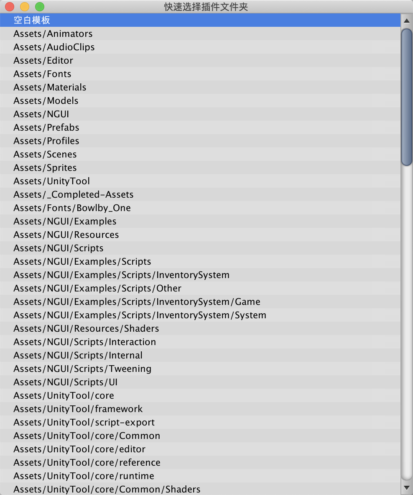
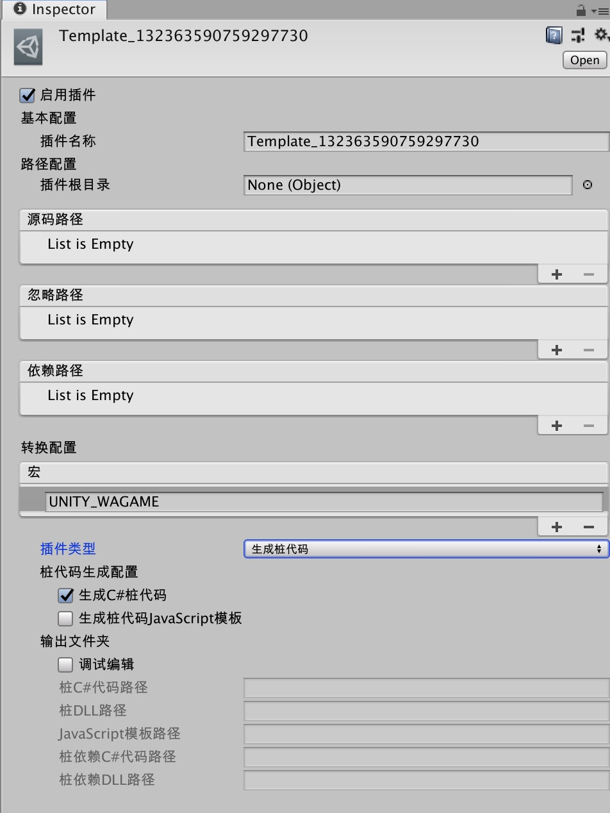

## 插件代码导出

> 背景： 受限于`代码转换`目前只能对`C#`源码进行处理，转换到`js`代码上，因此如果项目工程中使用到了DLL的库，则会在转换业务代码调用处时，因找不到对应接口的`C#`实现，导致转换失败。此外，即便是有源码的插件，也可能因为某些接口或某些特殊用法等暂时不支持的原因，导致转换失败。

### 概述
为了解决上述问题，我们建立了一套专门处理`插件代码导出`的机制，主要用于解决遇到**代码转换不成功**的问题。并且由此，也衍生出了一个可以进行`代码分模块导出`的功能，后面将详细叙述。

### 添加插件配置
安装好`Script导出模块`后，可以在`微信小游戏`菜单栏中点选`一键快速导出`，在弹出的窗口中进行插件配置信息的增添。

点选`工程插件列表`的List右下方的`+`，会打开一个快捷添加`插件配置信息`的窗口，此处罗列出项目中的所有文件夹

双击罗列出来的文件夹路径，即可快速创建以该文件夹为`根目录`的`插件配置信息文件`，注意只需要点选插件**父目录**，子目录无需选择。如果你的工程中文件夹数量过于庞大以至于无法方便索引，可以直接双击点选`空白模板`，即会快速创建一个信息均为空的`插件配置`文件。

（空白配置文件默认命名为`Template_${Timestamp}`，请自行修改)

在快速创建好`插件配置`后，直接关闭该窗口，新创建的这些配置文件将会自动地被添加到`工程插件列表`里。另外，若在配置文件所在的文件夹下存在`插件配置文件`的情况下，点击`工程插件列表`的`+`键，会自动添加所有该目录下的`插件配置文件`到列表中。

### 编辑插件配置

随便点开一个`插件配置文件`，可以在`Inspector`中方便地进行配置

* 启用插件： 表示是否启动该插件的转换/生成桩代码逻辑
* 基本配置
    * 插件名称： 表示这个插件的名称，这个名称应该是`独一无二`的
* 路径配置
    * 插件根目录： 表示插件所在的根目录，采用`Asset Folder`的形式，需要在`Project`面板中拖拽相应目录到该配置项中
    * 源码路径： 插件源码所在路径，由于根目录下可能存在形如`src`、`editor`等子目录，此处应包括所有希望被转换/生成桩代码的`C#`源码路径（注意必须为`插件根目录`下的子目录，此处只支持`Asset Folder`形式
    * 忽略路径： 与`源码路径`类似，功能为需要被忽略的子目录如`Editor`、`Example`等
    * 依赖路径： 此处需要选择该插件的`DLL`的存放路径（若不存在则无需添加），将会被`生成桩代码`的逻辑里使用
* 转换配置
    * 宏： 即在编译时会使用到的宏，无论是桩代码生成还是代码转换，都会被使用到
    * 插件类型： 该项有两个选择，`生成桩代码`或`转换代码`
        * `生成桩代码`将会把上述`路径配置`中的`源码`以及`依赖`在排除了`忽略`下，生成对应的桩代码实现，此处详见：[第三方插件](./third.md)
            * 生成C#桩代码：启用此项意味着工具会将上述配置下的代码，转换为`C#`版本的桩代码，这个桩代码的用途是
                * ①保证使用到该插件接口的调用处代码编译通过
                * ②作为生成`JS`模板的`C#`模板
            * 生成桩代码JavaScript模板：启用此项意味着工具会将上述`C#`桩代码进行处理，并最终生成一份带有所有`public`的接口的`js`空实现脚本，需要进行填充`js`桩代码，此处详见：[第三方插件](./third.md)
        * `转换代码`则会将上述`路径配置`中的`源码`在排除`忽略`下，使用`代码转换能力`将其从`C#`转换成`JS`，注意这种情况下`依赖`配置项是无效的。此项也可用于上文开头提到的`代码分模块导出`功能。
        * 输出文件夹：两个类型均有该项，具体用于展示输出的文件的路径，默认不允许修改

### 导出插件代码

在配置好所有的`插件配置信息`后，即可进行插件代码转换，勾选`导出插件代码`项，并点击`导出`按钮即可

