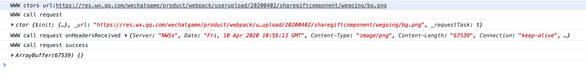

## 网络接口

小游戏内提供了[wx.request](https://developers.weixin.qq.com/minigame/dev/api/network/request/wx.request.html)接口用于网络请求，
而Unity的网络请求是通过[WWW](https://docs.unity3d.com/2018.3/Documentation/ScriptReference/WWW.html)实现的，这里通过Adaptor，Unity内调用WWW方法的时候最终调用的是wx.request。

这里需要注意的是，由于wx.request请求只能支持https请求，因此WWw暂时也只能支持https请求，如果需要支持一些其他请求，需要自行改造Adaptor来实现；

### MP端配置域名信息
小游戏内要通过wx.request请求后台接口，还需要在MP端进行配置，配置流程如下：
- 1.登录[mp.weixin.qq.com](https://mp.weixin.qq.com)；
- 2.根据路径打开页面：开发 -> 开发设置；
- 3.配置服务器域名，配置示意如下：


### 示例
#### Unity工程
创建一个空Unity项目，右键新建一个GameObject，并且添加下面Component
```cs
// Get the latest webcam shot from outside "Friday's" in Times Square
using UnityEngine;
using System.Collections;

public class TestNetwork : MonoBehaviour
{
  public string url = "https://res.wx.qq.com/wechatgame/product/webpack/userupload/20200402/sharegiftcomponent/wegoing/bg.png";

  void Start(){
    WWW www = new WWW(url);

    Debug.Log(www);
  }
}
```

#### 小游戏工程
将Unity工程经过导出插件为小游戏项目后，运行结果如下：




