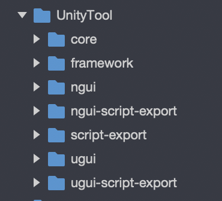

# 贡献指引

## 开发插件须知
*  开发者将unity-plugin拷贝到Unity Assets目录下进行开发
*  NGUI导出模块依赖NGUI，请下载相应的包，或主动删除unity-plugin/ngui文件夹 或改名为 unity-plugin/ngui~

## 目录结构介绍
插件代码目录目前较为简单如下：

* core目录为基础脚本，负责材质导出，引擎内置组件导出等基础功能；

* framework目录为相关导出菜单窗口代码；

* ngui目录作用类似ugui目录，如果不使用ngui可以将该目录删除，以免未按装ngui插件时导出插件报错

## MR规范
* MR前请先自测通过确保资源导出和代码导出正常，并写清楚MR的详情。

## Issue规范
为帮助我们定位问题，请提供以下信息：
* Unity版本
* 导出面板的配置截图
* 小游戏引擎版本（在小游戏项目的engine.ide.json文件中的 engineVersion字段）
* 报错截图
* 最好能提供简单可复现的demo

