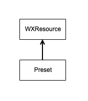
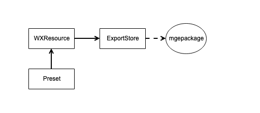

# 导出插件的架构

首先，我们可以从导出插件的主UI开始理解。图中所显示的`导出当前场景`、`导出选中的prefab`在本项目里的概念叫`导出模式(Preset)`。`Preset`是所有导出动作的驱动器或者说起点。(关于preset的编写，可以参考[这里](./custom-preset.md))

-------------------------------

一般来说，导出插件的逻辑就是将指定的Unity资源转换为微信方案的资源格式。因此`Preset`里面会初始化一个资源转换器`WXResource`(它是个基类，继承它的有WXPrefab、WXScene)，由该类负责把unity的格式转换为我们的格式。

`WXResource`对资源进行完转换之后，会把资源存在一个叫`ExportStore`的逻辑对象里。它是用来记录资源内容、防止资源被重复转换用的。`ExportStore`最终还会负责生成`mgepackage`用以将资源导入微信方案编辑器。

大部分情况下，我们要转的是类似`Prefab`和`Scene`这样的资源。那么这里就需要对它们的节点树进行递归遍历，并将所有节点的component一一进行转换。这部分职能在本项目里由`WXComponent`承担（本项目里，继承它的有`WXMeshRenderer`等）。

其中如`WXMeshRenderer`这样的组件又会用到`Mesh``Material`这样的资源，所以`WXComponent`同时也会触发`WXResource`的逻辑

如上，就是整个导出插件运行的逻辑和过程