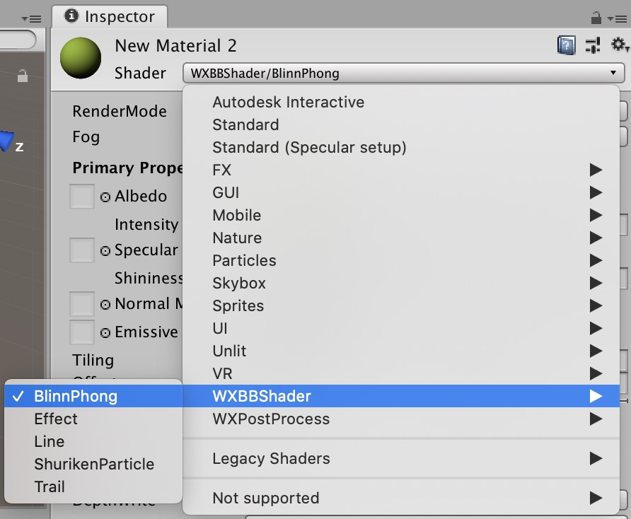
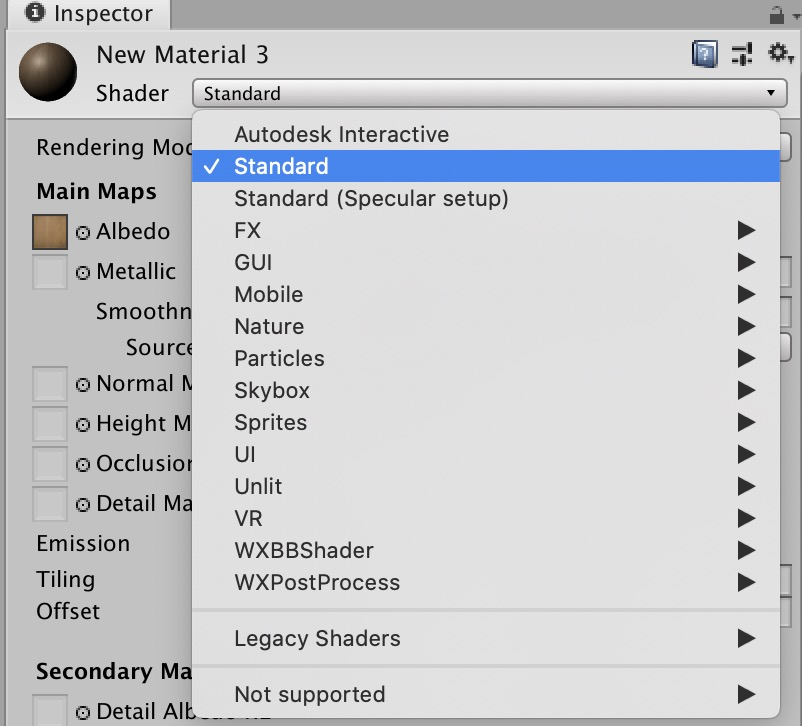
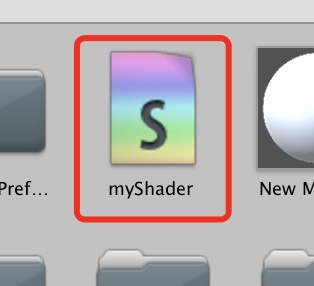
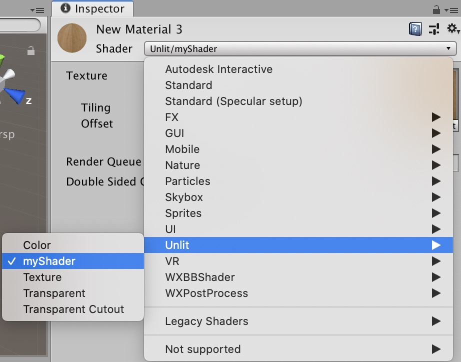
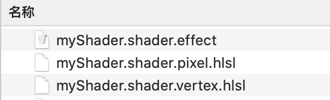
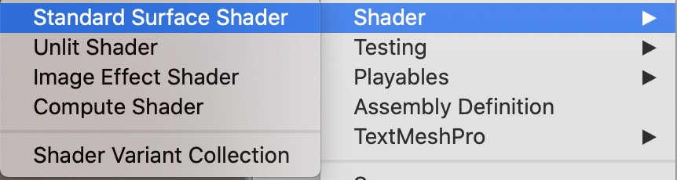

## shader自动映射逻辑

在用户使用Unity导出插件导出场景(或prefab)时，导出插件会**尝试**自动将场景内的材质shader转换成对应的微信方案effect。

如果没有办法找到比较对应的effect，就会在导出的资源包里生成effect文件(供用户修改)，并自动将导出的材质与生成的effect资源相关联。

+ ***WXBBShader* 类型下的插件内置shader**  
  这一类shader在**没有**安装插件的情况下，**不会**出现在材质shader的选择列表里。  
    
  例：*WXBBShader/BlinnPhong*。
  这一类shader会被自动转换成引擎内部对应的effect，用户**无需**进行额外操作。  
  引擎对应的effect在渲染时的表现与unity里插件内置的shader**一致**。

+ ***Standard* 等unity自带的shader**  
    
  会被统一自动转换成unity_builtin_extra.effect放置在导出资源包里。  
  由于不同的unity内置shader会被导出成同一个effect，所以**不建议**直接导出这一类shader。  
  **具体处理方法**请详见[转换建议](#转换建议)。

+ **用户自己写的自定义shader**  
  
    
    
  会被导出成对应路径下的effect资源，需要用户在导出完成之后，自行手动修改。  
  一共生成三个文件:
    1. {shader名}.shader.effect
    2. {shader名}.shader.vertex.hlsl
    3. {shader名}.shader.pixel.hlsl  
  

  **具体修改方法**请详见[ShaderLab迁移教程](./custom.md)。

## 手动shader映射

  通过自己写unity脚本来补充插件导出逻辑，可以将某一类shader，指定转换成某一种effect。  
  [点此进入](./parser.md)
  这一节需要一些学习成本，并且可用其他方法替代，没有特殊需求的话，建议[跳过](#转换建议)这一节。  

## 转换建议

  + ***Standard***  
  建议直接**在unity内**替换成*WXBBShader/BlinnPhong*。  
  但是两者还是有比较大的区别的，*Standard*是PBR渲染，功能比*BlinnPhong*强大很多。  
  微信引擎内部由于手游性能以及开发进度的原因，暂时没有支持PBR。所以将*Standard*转换成*WXBBShader/BlinnPhong*的过程中，必定会损失一些表现的。  
  参数建议：
    - Metallic → Specular
    - Smothness → Shininess
    - 其他同名替换即可

  + **其他unity内置shader**  
  都建议**在unity内**替换成 WXBBShader 类型下的shader。  
  如果没有对应功能的，建议在unity内新建一个空白的unlit shader，替换成该shader并导出，以便后续进行手动修改。  

  + **自定义shader**  
  微信引擎内的shader语言是hlsl，与Shaderlab的CGPROGRAM块内的语法一致，所以将自定义shader迁移至微信引擎还是比较容易的。  
  具体的迁移过程参考[这里](./custom.md)。

# 从ShaderLab到微信Effect

## ShaderLab格式
对Unity ShaderLab不熟悉的同学，可以参考[Unity官方文档](https://docs.unity3d.com/Manual/SL-Shader.html)。

## 微信引擎Effect文件格式
Effect是一种json格式的文件，描述的信息与ShaderLab有些类似，记录了properties、纹理、和pass信息。  
请参考[微信引擎文档](https://developers.weixin.qq.com/minigame/dev/game-engine/render/shading/effect.html)。

## 修改Effect
在了解微信Effect文件格式之后，进行迁移。  
首先找到导出资源包里的自动生成的.effect文件，然后修改：

### Properties
ShaderLab Properties其实是就是为pass内的CGPROGRAM指定了Shader Constants(uniform)。

在Effect文件中与之对应的是*shaderProperties*和*textures*属性。  
例：
```
Shader "xxx" {
    Properties {
        _MainTex("Albedo Texture", 2D) = "white" {}
        _Color("Albedo Color", Color) = (1,1,1,1)
    }
}
```

对应的Effect内容为：
```json
{
    "shaderProperties": [
        {
            "key": "_Color",
            "type": "Vector4",
            "default": [1,1,1,1]
        }
    ],
    "textures": [
        {
            "key": "_MainTex",
            "type": "Texture2D",
            "default": "white"
        }
    ]
}
```

Property类型迁移：
+ Numbers and Sliders  

  | ShaderLab Property | 微信Effect |
  | --- | --- |
  | Int, Float, Range | Float |

  > 放在Effect内*shaderProperties*字段中

  微信Effect内没有Range功能，直接用Float。  
  Float的默认值也需要使用数组来表示，例：
  ```json
    {
        "key": "_Exposure",
        "type": "Float",
        "default": [1.0]
    }
  ```
+ Colors and Vectors

  | ShaderLab Property | 微信Effect |
  | --- | --- |
  | Color, Vector | Vector4 |

  > 放在Effect内*shaderProperties*字段中

  其实微信Effect也有Vector3和Vector2类型，但是ShaderLab没有提供，迁移的过程中应该用不到。  
  例：
  ```json
    {
        "key": "_MainTex_ST",
        "type": "Vector4",
        "default": [1, 1, 0, 0]
    }
  ```
+ Textures

  | ShaderLab Property | 微信Effect |
  | --- | --- |
  | 2D | Texture2D |
  | Cube | TextureCube |
  | 3D | 无 |

  > 放在Effect内*textures*字段中

  3D texture微信引擎内暂不提供。  
  Texture2D和TextureCube的默认值都只能设置为"white"或者"black"。  
  例：
  ```json
    {
        "key": "_MainTex",
        "type": "Texture2D",
        "default": "white"
    }
  ```
  
### SubShader Pass
对应微信Effect内的passes字段，是一个数组，包含了所有的pass。
```json
{
    "passes": [
        // ...
    ]
}
```

### Pass RenderSetup
对应微信Effect内某一pass的renderStates属性。
+ Cull
  > 对应cullOn和CullFace属性

  | ShaderLab | 微信Effect |
  | --- | --- |
  | Off | cullOn: false |
  | Back | cullOn: true, cullFace: "BACK" |
  | Front | cullOn: true, cullFace: "FRONT" |

+ ZTest
  > 对应depthTestMode属性

  | ShaderLab | 微信Effect |
  | --- | --- |
  | Less, Greater, LEqual, GEqual, Equal, NotEqual, Always | 大写后赋值给depthTestMode属性(例:LESS) |

+ ZWrite
  > 对应depthTestOn属性

  | ShaderLab | 微信Effect |
  | --- | --- |
  | On | depthTestOn: true |
  | Off | depthTestOn: false |

+ Offset
  > 对应：无

+ Blend
  > 对应blendOn、blendSrc、blendDst、blendFunc属性

  具体情况比较复杂，请参考[微信引擎文档](https://developers.weixin.qq.com/minigame/dev/game-engine/render/shading/effect.html#renderStates)。

+ ColorMask
  > 对应：无

### Pass Lightmode
对应微信Effect内某一pass的*lightMode*属性。
只支持少数几种Lightmode，详见[文档](https://developers.weixin.qq.com/minigame/dev/game-engine/render/shading/effect.html#passes)。

### Multicompile
想要在某一pass内使用Fog、阴影、lightmap、骨骼动画的话，需要在微信Effect中开启multicompile。
```json
{
    // ...
    "passes": [{
        // lightmode and others...
        "multiCompile": [
            [
            "USE_RECEIVE_SHADOW",
            "__"
            ],
            [
            "USE_SKIN",
            "__"
            ],
            [
            "USE_FOG",
            "__"
            ],
            [
            "USE_LIGHTMAP",
            "__"
            ]
        ]
    }]
}
```

## Shader迁移
找到导出资源包内生成的两个shader文件：
1. {shader名}.shader.vertex.hlsl
2. {shader名}.shader.pixel.hlsl

然后将Shaderlab的pass内的CGPROGRAM内的代码迁移至这两个文件中。  
**请先参考[文档](https://developers.weixin.qq.com/minigame/dev/game-engine/render/shading/shader.html)，了解微信shader文件格式**。

如果unity内的原shader是：

+ **Unlit Shader**  
    
  shader的CGPROGRAM内有vert和frag两个函数，分别迁移至.vertex.hlsl和.pixel.hlsl即可。  
  迁移过程中大部分代码复制即可，unity内置函数(比如说UnityObjectToClipPos、 TRANSFORM_TEX等)需要查阅[微信文档](https://developers.weixin.qq.com/minigame/dev/game-engine/render/shading/shader.html#%E4%BD%BF%E7%94%A8include)对应内置函数，用法基本上一致。

+ **Surface Shader**  
    
  Unity内的surface shader是基于Unity的PBR模型的，在shader内修改PBR参数提供给Unity渲染。  
  由于微信引擎暂未支持PBR功能，所以也不支持surface shader。  
  Unity项目中使用了surface shader的材质，建议替换成BlinnPhong光照模型(在导出的shader内自己实现，或者在Unity内直接使用*WXBBShader/BlinnPhong*)。

## 多Pass
目前导出工具只能自动新建一个pass的两个shader文件(.vertex.hlsl和.pixel.hlsl)，并自动填充在Effect里的第一个pass内。

如果需要使用多Pass，需要自己手动在导出的Effect的位置处另外新建两个shader文件(.vertex.hlsl和.pixel.hlsl)，并手动在Effect文件内新增一个pass，将新建的shader文件路径填充至vs和ps字段。  
例：  
```json
// created new.shader.vertex.hlsl and new.shader.pixel.hlsl
{
    // ...
    "passes": [
        {
            // auto generated pass 1
        },
        {
            // lightmode and others...
            "vs": "./new.shader.vertex.hlsl",
            "ps": "./new.shader.pixel.hlsl"
        }
    ]
}
```
***

\[[返回](./index.md)\]