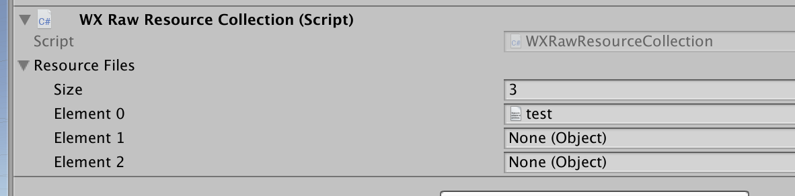

# 原始资源导出与使用
在游戏开发中，经常会遇到需要使用json配置、音频、视频等文件的情况。这种文件和游戏逻辑本身其实并没有强关联，因此本文将其称之为`原始资源`

由于微信小游戏性能优化方案有一套高智能的，根据游戏资源依赖关系进行加载的资源系统，这个资源系统能对游戏的资源进行统一的优化，但对于上述的文件，就需要使用`原始资源`的概念进行封装，才能通过资源系统加载。

## 原始资源的导出
如果你使用的不是[完整项目导出](../fullproject/flow.md)，且希望这些配置文件能和你的游戏场景一起加载，那么你可以选择给任意GameObject添加 WX Raw Resource Collection这个组件，并将这些文件都挂载上去。

导出并导入到微信方案后，你就能从对应的游戏节点上，获取`RawResourceCollection`组件，就能得到这些资源

又或者你只是想导出这些文件过去，随后自己通过`loader.load`加载。那么只要你选择使用`导出选中资源`模式，就可以将这类文件导出成微信方案的`原始资源`，将其导入微信方案即可。

## 原始资源的使用

不管是通过`RawResourceCollection`得到，或者是直接使用`loader.load`加载，你最终得到的会是一个微信方案的`RawResource`实例。此时通过`rawResource.value`就能获取到你原本文件的内容。

其中，json配置、纯文本等会以字符串形式返回。音频、视频会以url形式返回，正好可以用于调用微信小游戏的音频、视频api。