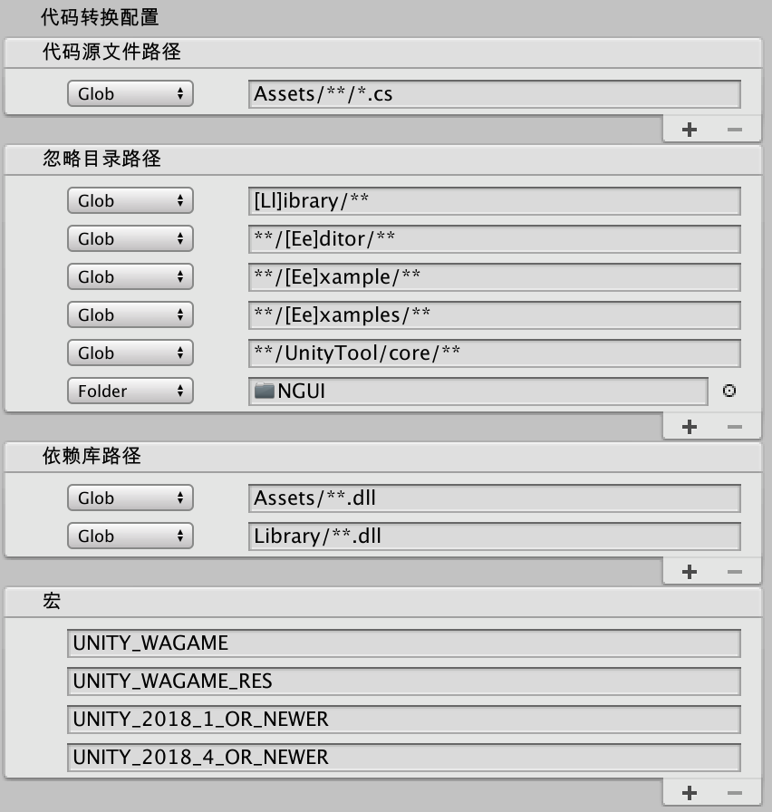

## 代码导出配置

此处以`一键快速导出`窗口为例说明`代码导出配置`的各则细项用途

### 全局配置

> 背景：进行转换后的业务`js`脚本上，存在着各种对`系统接口`和`Unity引擎接口`的调用，在此处从C#的实现（`.net runtime`)桥接到`js`中，需要有一层适配层，此处的适配层js代码会随代码转换而生成并输出到`WXScripts.mgepackage`。

在这种情况下对该`mgepackage`解压后，这层`通用的适配代码`会随业务代码一同进入小游戏工程，增加包体积。因此此处引入一个解决方案，使用微信小游戏提供的`小游戏插件`能力，使用`远程端`提供的这份适配代码，保证用户包内**只存在`业务逻辑`，减少包体积，从而减少首包的下载时间**。详细介绍见：[Adaptor小游戏插件](../adaptor/adaptor-plugin.md)

此处开放入口开启或关闭`使用小游戏插件`主要目的为针对以下场景：**需要对适配代码进行定制化修改**

此处两项配置分别作用为
* `使用Adaptor引擎插件framework`: 使用微信小游戏插件，并只使用`系统接口`的适配代码。由于该部分代码实现相对完善并可靠，因为需要针对性修改此部分代码的情况较少，此处建议保持默认`开启状态`
* `使用Adaptor引擎插件runtime`： 使用微信小游戏插件，包括上述`系统接口`并使用`Unity接口`的`js-adaptor`，此项也是默认开启，如果在使用过程中发现有部分接口并未实现，即可关闭该项，通过自行适配开发该接口并构建的方式，保证运行时跑通业务逻辑。此处的具体适配及构建流程见：[js-adaptor适配开发](../adaptor/adaptor.md)

### 代码转换配置

> 此处配置对整个游戏工程中，需要进行转换的代码路径进行配置，以令转换模块针对用户配置的目录信息进行识别扫描后，对这部分的`C#源文件`进行一系列的处理，最终转译并落地为`js`文件

此处配置项包括两大部分，第一块是`路径配置`，支持`Glob匹配`以及`Asset Folder`，可在相应区块进行`添加删除`，并在左侧进行选择`匹配类型`。

* `Glob匹配模式`即直接填入需要进行匹配的`Glob串`，此处以整个工程的根目录（即`Assets/`的父目录）作为`Glob`匹配的根目录
* `Asset Folder匹配模式`即为直接在`Project面板`中将文件夹以`拖拽`的形似添加到列表中，以该文件夹为根路径递归处理其下`所有文件及文件夹`

* 代码源文件路径：需要被转换的`C#源代码`所在路径，默认值为`Glob: Assets/**/*.cs`，即转换全部在`Assets/`下的`.cs`文件
* 忽略目录路径： 需要被忽略的文件所在路径，例如我们不想对任意目录下的`[Ee]ditor`子目录进行转换，因为`Editor`的代码只会在`Unity编辑态`中被使用，不会在运行时执行
* 依赖库路径： 工程需要依赖的`dll`文件，此处目前仅作为`静态分析`使用，保持默认无需修改

### 其他配置

* Glob忽略大小写：上述`Glob串`中忽略大小写进行匹配，该功能默认为关闭