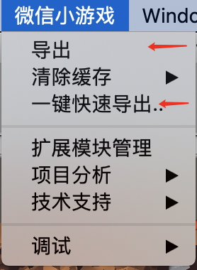
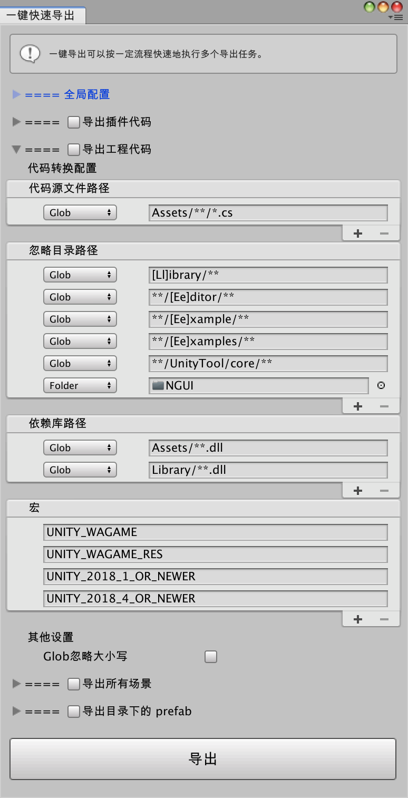

## 工程代码导出

### Script导出模块
确保已从`微信小游戏-扩展模块管理`窗口中安装`Script导出模块`后，可以在`微信小游戏`菜单栏中选择`导出`或`一键快速导出`，在弹出的窗口中进行工程代码的配置及导出操作

### 配置Script导出模块

`Script导出模块`安装成功后，打开`微信小游戏-导出`面板，会扩展一项`导出工程脚本`的模块

`一键快速导出`打开后的窗口中同样有脚本导出的配置面板

该配置项中的各项具体说明详见[脚本导出配置](./config.md)

### 使用Script导出模块

* 在确认配置无误后，直接点击**导出**按钮，即可启动C#脚本转换功能，将配置信息内匹配所得源文件进行转译，生成对应js脚本，并打包成`WXScripts.mgepackage`输出到`目标导出路径`中
* 在`微信开发者工具-优化方案`中解压该`WXScripts.mgepackage`，即可完成转换后的js脚本的导入