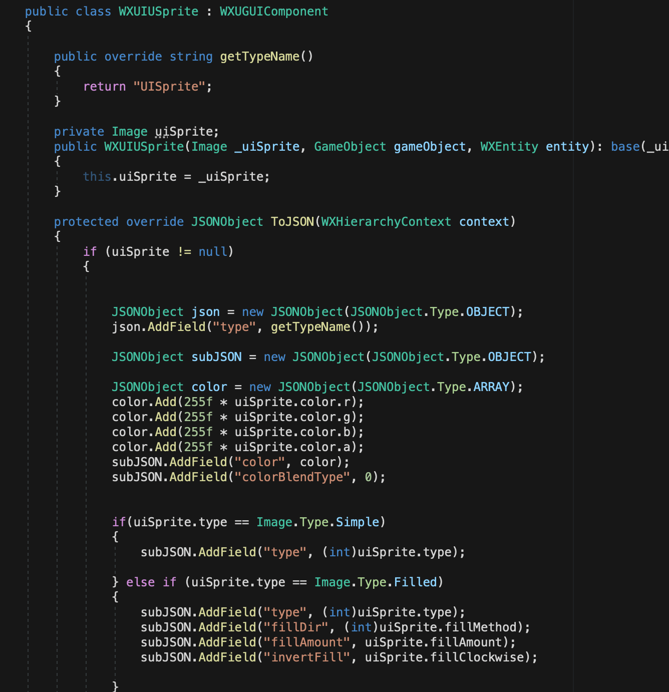
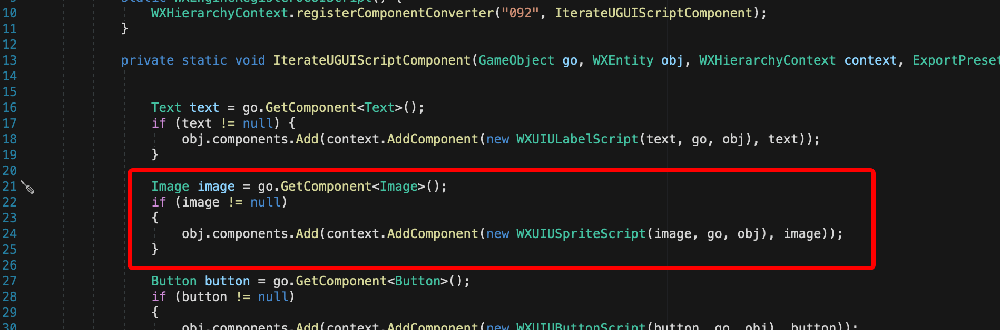
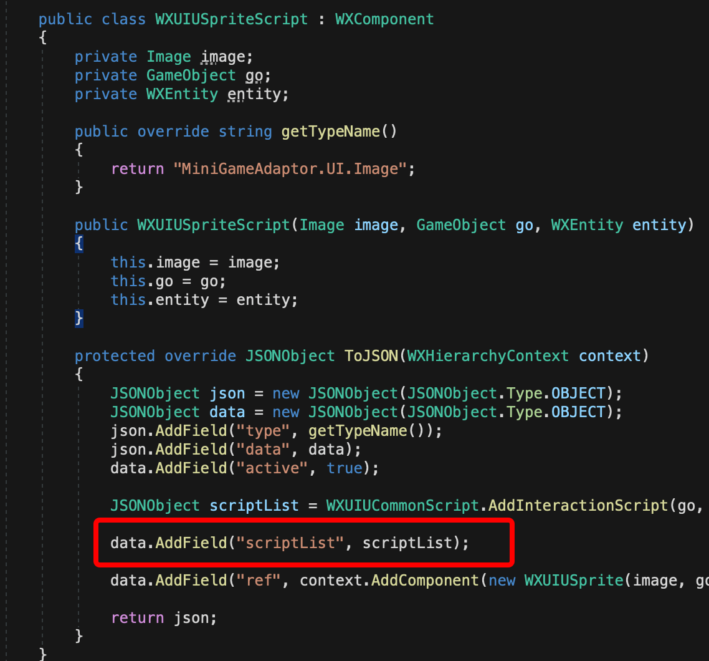
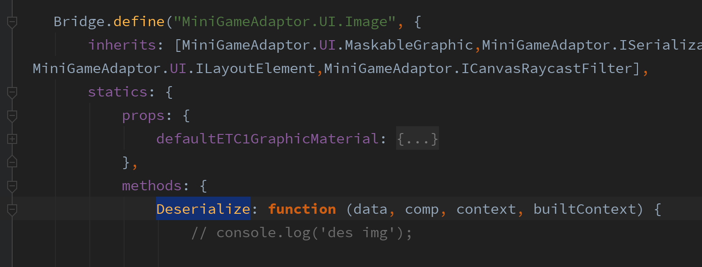

# 扩展UGUI导出插件

##  UGUI导出插件的实现：
* 1、导出场景的根UICanvas节点开始递归遍历所有节点。记录相关属性到导出文件中。
* 2、adaptor解析导出文件中的信息，生成对应小游戏组件。

注意：因为小游戏引擎的设计问题，目前导出插件只支持单独导出2D或者3D的scene。不支持一个scene里面同时包含2D和3D的情况。可将2D和3D分开至两个scene，2D和3D的跟随问题可以再写跟随脚本单独处理。

目前已经适配的UGUI组件可查看[这里](./ugui-list.md)。对于目前不支持的可以按本文档指引扩展。下面介绍如何具体修改：

## 1、添加UGUI组件至导出黑名单
 在script-export/editor/src/WXMonoBehaviourExportHelper.cs 这个文件的WXMonoBehaviourExportHelper这个类的 _propertyBlacklist属性中添加需要导出的组件名称如下图：

 

 同时在 _engineUGUISupportWhitelist 属性中添加该组件对应的处理类如下图：

  

## 2、注册组件的处理脚本
在 ugui/editor/Component/register/WXEngineRegisterUGUI.cs 
如下图 （这里以添加Image为例）：

其中WXUIUSprite为Image的导出处理类，如下图：

其中getTypeName 返回的是小游戏中对应的组件名，可在[这里](https://developers.weixin.qq.com/minigame/dev/game-engine/ui/uisprite.html)参考对应的组件和说明，
ToJSON 方法就是记录UGUI到小游戏组件的映射。比如UGUI的Image的fillMethod属性是跟小游戏的UISprite的fillDir相对应的，
所以有 `subJSON.AddField("fillDir", (int)uiSprite.fillMethod);` 这行代码来做属性的映射

## 3、注册组件额外处理脚本
在ugui-script-export/editor/src/Component/register/WXEngineRegisterUGUIScript.cs 注册处理脚本。
如下图 （这里以添加Image为例）：

为什么还要有额外的处理脚本，这是因为UGUI的组件的属性和小游戏的并不是一一对应的，所以需要导出额外的属性在小游戏的adaptor中编写额外的脚本处理。
比如WXUIUSpriteScript中，我要对绑定到Image上的脚本也做属性导出，让adaptor 知道当前Image上绑了哪些脚本，就会需要像下图所示：

这里 getTypeName 返回的是adaptor中定义的解析类名

## 4、修改adaptor
上面导出的组件很多时候并不能完全正常使用，所以我们需要自己写一些adaptor的代码来达到我们想要的效果。以Image为例：
js-adaptor/src/UGUI/Image.js 我们需要找到这个文件，为什么是找这个文件？因为这个文件定义的解析类名与导出脚本的getTypeName相一致。

`Deserialize`是自定义的解析处理方法，我们大部分适配逻辑都写在这里。 其参数意思如下
* data：ugui导出脚本里面记录的额外导出信息
* comp：小游戏的组件节点
* context：整个json parse后的原始context
* builtContext：做过Deserialize的comp后的context，能访问到其他组件

小游戏中的api可参考[这里](https://developers.weixin.qq.com/minigame/dev/game-engine/intro/)

